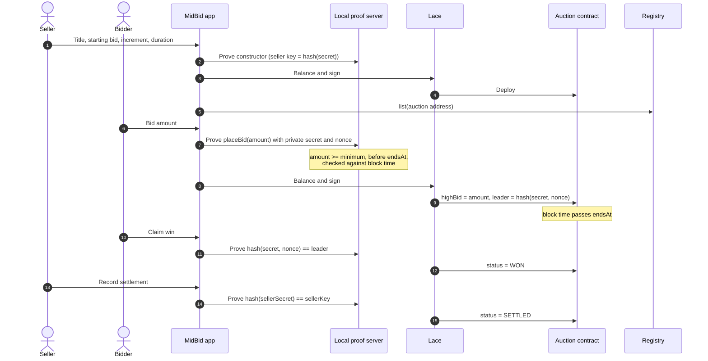
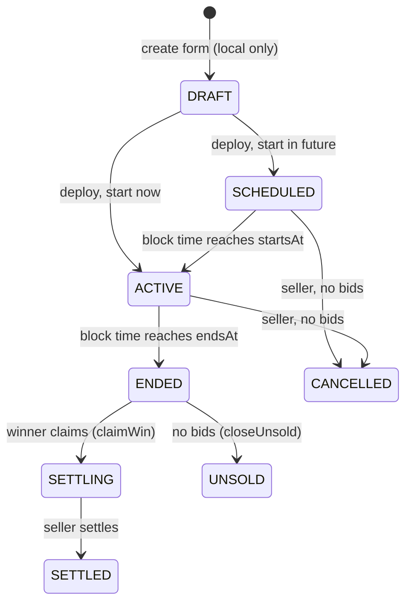

<p align="center"></p>

# MidBid

**See the price. Not the bidder.**

[](https://github.com/JayCul/midbid/actions/workflows/ci.yml)


MidBid is a live auction marketplace on [Midnight](https://midnight.network). Everyone sees
the current high bid. Nobody sees who placed it. The auction's rules run in a Compact
contract, and the winner only steps forward once the auction has ended.

| | |
|---|---|
| Live app | _added at deploy_ |
| Registry contract (Preprod) | _added at deploy_ |
| Example auction (Preprod) | _added at deploy_ |
| Product profile on X | _added at launch_ |
| Demo video | _added at submission_ |

---

## Why Midnight

An ascending auction needs a public price, so bids can be beaten. It does not need a public
bidder. On a transparent chain, every bid is tied to an account, so anyone can watch who is
bidding, how they bid and how high they go, and use that against them.

MidBid uses Midnight to split those apart:

- A bid publishes the **new price** and a **fresh commitment** to the bidder's secret. No
  account, name or key is written to contract state.
- No two bids share a commitment, even from the same bidder, so a bidder cannot be followed
  through an auction.
- Bids that would not lead fail on the bidder's own machine and never reach the chain.
- The winner proves they can open the leading commitment. That is the only moment a bidder
  steps forward, and only the winner does.

The honest limits are in [docs/PRIVACY.md](docs/PRIVACY.md). The short version: contract
state reveals nothing about bidders, but the wallet paying a transaction's fee can still be
visible to network-level analysis, and MidBid does not claim otherwise.

## How it works



### Lifecycle



The contract stores `OPEN`, `CANCELLED`, `UNSOLD`, `WON` and `SETTLED`. `SCHEDULED`,
`ACTIVE` and `ENDED` are `OPEN` read against the clock. Every circuit checks block time
itself, so the UI deriving them cannot loosen a rule.

## What is public and what is not

| Public, on purpose | Never written to the chain |
|---|---|
| Listing details, starting bid, increment, start and end | Which bidder placed the high bid |
| Current high bid and number of accepted bids | Whether two bids came from the same bidder |
| Status, from live to settled | Bids that would not have led |
| A commitment to the current leader | Bidder and seller secrets |
| A hash of the seller's secret | Anything linking a bidder to their commitments |

## Features

- Connect Lace on Preprod, with network, proof server and DUST checks before any action
- Create an auction in three steps with a live preview
- Browse live and ended auctions, search, and open any auction by address
- Private bidding with contract-enforced minimum, increment, start and expiry
- Live countdown and public high bid, refreshed from the indexer
- A private "your position" panel computed only on your device: whether you lead, and your
  own bid history
- Winner claim, unsold closing, seller settlement and seller cancellation before any bid
- My activity: the auctions this browser created or bid in
- Activity log showing every wallet, proof and network step
- Black and gold responsive design with a light theme, keyboard focus states and reduced motion

## Quick start

### Prerequisites

- Node.js 22 and npm
- Docker, for the local proof server
- [Lace](https://www.lace.io/) with Midnight enabled, set to **Preprod**, holding tNIGHT
  registered for DUST generation. Faucet: <https://faucet.preprod.midnight.network>
- Only to recompile contracts: the Compact toolchain, pinned to 0.31 (see below)

### Run

```bash
git clone https://github.com/JayCul/midbid.git
cd midbid
npm install
cp .env.example .env.local   # set VITE_REGISTRY_ADDRESS
npm run proof-server         # in a second terminal
npm run dev
```

Open <http://localhost:5174>. The compiled contracts are committed under `managed/`, so the
app runs without the Compact toolchain.

### Scripts

| Script | What it does |
|---|---|
| `npm run dev` | Sync circuit keys, regenerate provenance, start Vite |
| `npm run build` | Same, then a production build into `dist/` |
| `npm test` | Contract, service, model and component tests |
| `npm run test:contracts` | Only the contract tests, against the compiled circuits |
| `npm run lint` | Typecheck and Prettier check |
| `npm run format` | Prettier write |
| `npm run compact` | Recompile both contracts (needs Compact 0.31) |
| `npm run proof-server` | Start the Midnight proof server on port 6300 |
| `npm run deploy:preprod` | Check the configured registry exists on Preprod, then build |
| `npm run find -- <address>` | Read any auction from the indexer and check it is genuine |

### Environment variables

All are optional and documented in [.env.example](.env.example).

| Variable | Default | Purpose |
|---|---|---|
| `VITE_REGISTRY_ADDRESS` | none | Registry that Browse reads |
| `VITE_X_PROFILE_URL` | none | Footer link to the product profile |
| `VITE_NETWORK_ID` | `preprod` | Must match the wallet's network |
| `VITE_INDEXER_URL` / `VITE_INDEXER_WS_URL` | Preprod indexer | Public state reads |
| `VITE_PROOF_SERVER_URL` | `http://127.0.0.1:6300` | Local proof generation |

No variable holds a seed or key. Lace signs every transaction.

## Using MidBid

1. **Connect.** Start the proof server, open the app, click Connect and approve in Lace. On
   the hosted site, Chrome asks to let the page reach apps on your device; allow it so the
   page can reach the proof server.
2. **Create.** Go to Create, describe the item, set the starting bid, increment and duration,
   review, and deploy. Lace asks twice: once to deploy the auction, once to list it.
3. **Bid.** Open a live auction, enter at least the minimum shown, and place the bid. The
   proof is generated locally. If someone outbids you first, the contract rejects your
   transaction and nothing is recorded.
4. **Win.** After the end, the winning device sees Claim win. Claiming opens the leading
   commitment on chain.
5. **Settle.** The winner and seller complete the exchange. The seller then records
   settlement from the device that created the auction.

Bids are commitments to pay, not escrowed funds. Escrow is on the roadmap.

## Contract

Two Compact contracts, compiled with toolchain 0.31.1 (language 0.23, compact-runtime
0.16.0), the line that targets the ledger Mainnet runs today.

- [`src/contracts/auction.compact`](src/contracts/auction.compact): one deployment per
  auction. Circuits `placeBid`, `claimWin`, `closeUnsold`, `settle`, `cancel`.
- [`src/contracts/registry.compact`](src/contracts/registry.compact): the list of auction
  addresses Browse reads. Discovery only.

Full reference: [docs/CONTRACT.md](docs/CONTRACT.md).

### Recompiling

The Compact compiler runs on Linux and macOS. On Windows, use WSL:

```bash
curl --proto '=https' --tlsv1.2 -LsSf https://github.com/midnightntwrk/compact/releases/latest/download/compact-installer.sh | sh
compact update 0.31
npm run compact
```

Compilation is deterministic. CI recompiles and fails if anything under `managed/` differs
from the committed files, so the circuit commitment stored in every auction can be
reproduced from source.

## Tests

```bash
npm test
```

- **Contract (21):** terms, starting minimum, increments, block-time start and end, winner
  claims including an outbid bidder and a bidder with the right nonce but wrong secret,
  unsold closing, seller-only settle and cancel, and the registry's duplicate check. Each
  runs the compiled circuit, so the contract's own asserts decide the result.
- **Service (7):** decoding real ledger bytes, rejecting contracts with a different circuit
  commitment, and wallet-free reads.
- **Model (9):** lifecycle, bid checks that mirror the circuit, create-form validation, and
  defensive parsing of public metadata.
- **Components (7):** cards, countdown, badges, transaction references and routes.

## CI/CD

[`.github/workflows/ci.yml`](.github/workflows/ci.yml) runs on every push and pull request:

1. Install Compact, pin 0.31, compile both contracts, and diff `managed/` against the commit
2. `npm ci`, then check `src/provenance.js` matches the compiled circuits
3. Typecheck and Prettier check
4. Contract tests, then the full suite
5. Production build

The site deploys to Vercel from `main`. See [docs/DEPLOYMENT.md](docs/DEPLOYMENT.md).

## Documentation

- [docs/ARCHITECTURE.md](docs/ARCHITECTURE.md): components, data flow and provider stack
- [docs/CONTRACT.md](docs/CONTRACT.md): ledger, circuits, asserts and status transitions
- [docs/PRIVACY.md](docs/PRIVACY.md): what is disclosed, what is not, and the limits
- [docs/THREAT-MODEL.md](docs/THREAT-MODEL.md): attackers, attacks and mitigations
- [docs/DEPLOYMENT.md](docs/DEPLOYMENT.md): registry, Vercel and verification

## Roadmap

- Escrowed bids in tNIGHT, released to the seller on settlement
- Relayed or sponsored transactions, so the fee payer is not the bidder's wallet
- Invite-only auctions with a private allowlist of bidder commitments
- Sealed-bid mode, where even the high bid stays hidden until the end
- Soft close: extend the end when a bid lands in the final minutes

## License

MIT
