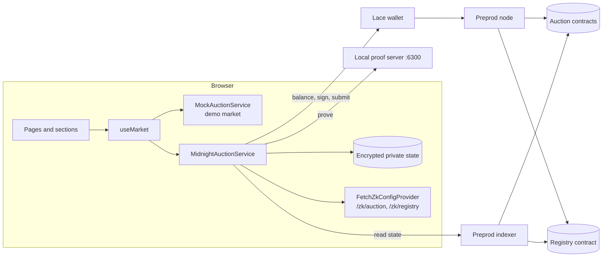

# Architecture

MidBid is a static single-page app talking to Midnight Preprod. There is no backend.

The UI depends only on service interfaces. Two implementations sit behind them: the demo market
(`MockAuctionService`, in memory, labelled everywhere it appears) and Midnight Preprod
(`MidnightAuctionService` with `LaceWalletService`). The Midnight stack is loaded on demand, so
the landing page never downloads the ledger WASM.

## Layers

| Layer | Files | Responsibility |
|---|---|---|
| Contracts | `src/contracts/*.compact`, `managed/` | Rules, state, proofs |
| Types | `src/types/auction.ts` | The `Auction`, `Receipt` and `Position` every screen uses |
| Interfaces | `src/services/types.ts` | `AuctionService`, `BidService`, `WalletService`, `ContractService` |
| Demo market | `src/services/mock/`, `src/data/showcase.ts` | In-memory auctions with the contract's rules; receipts are `{ kind: 'demo' }` |
| Midnight | `src/services/midnight/` | `MidnightAuctionService`, `LaceWalletService`, and `auctionClient.js` holding every midnight-js call |
| Model | `src/lib/auction/model.js`, `view.ts` | Pure functions: lifecycle, bid checks, metadata, terms, formatting |
| Wallet plumbing | `src/lib/midnight/` | Lace connector, transaction codec, tracing, proof server check |
| State | `src/hooks/useMarket.tsx` | Active market, wallet, log, lazy loading of the Midnight stack |
| Presentation | `src/components/`, `src/sections/`, `src/pages/` | No midnight-js imports anywhere |

Presentation never imports midnight-js. Pages call a service through `useMarket`. A Midnight
receipt carries the identifier Lace returned; a demo receipt carries none, so the UI cannot show
an invented transaction.

## Provider stack

Built once per wallet connection in `LaceWalletService`:

| Provider | Implementation | Notes |
|---|---|---|
| `publicDataProvider` | `indexerPublicDataProvider` | Also used without a wallet for reads |
| `privateStateProvider` | `levelPrivateStateProvider` | Scoped by wallet account, then `setContractAddress` per auction |
| `zkConfigProvider` | `FetchZkConfigProvider` | One per contract, from `/zk/<name>` |
| `proofProvider` | `httpClientProofProvider` | Local proof server |
| `walletProvider` | Lace adapter | `balanceUnsealedTransaction`, parsed back to a ledger `Transaction` |
| `midnightProvider` | Lace adapter | `submitTransaction`; returns `tx.identifiers()[0]` for watching |

`setNetworkId('preprod')` runs at module load, before any provider is built.

## Data flows

### Create

1. The form is validated by `buildMetadata` and `buildTerms`, the same rules the constructor
   asserts.
2. The service generates `sellerSecret`, computes `sellerPublicKey` locally, and calls
   `deployContract` with the secret as initial private state.
3. The deploy is proven locally, balanced and signed by Lace, and submitted.
4. The service calls `registry.list(address)`. If that fails, the auction still exists and the
   seller can retry from the auction page.
5. The address is added to this browser's local index.

### Bid

1. `bidProblem` checks phase and minimum against the latest indexer state.
2. The service loads or creates `bidderSecret`, generates a nonce, and writes both plus a
   `pending` bid record to private state **before** proving, so a closed tab cannot lose the
   nonce of a bid that lands.
3. `callTx.placeBid(amount)` proves locally. If another bid landed first, proving or the
   on-chain check fails, and the record is marked `failed`.
4. On success the record is marked `confirmed` with the transaction identifier.

### Position

`myPosition` reads private state and, for each of this device's bids, computes
`leaderCommitment(bidderSecret, nonce)` and compares it with the public `leader`. The match is
the leading bid. Nothing is sent anywhere.

### Discovery

Browse reads `registry.listings`, merges this browser's local index, fetches each address, and
keeps only contracts whose ledger decodes as an auction and whose `circuitCommitment` matches
`src/provenance.js`.

## Build

- Vite 5 with `vite-plugin-wasm` and `vite-plugin-node-polyfills`, target `esnext`
- `optimizeDeps.exclude` keeps the ledger and onchain-runtime WASM packages out of esbuild
- `overrides` pins `@midnight-ntwrk/onchain-runtime-v3` to 3.0.0 so the bundle carries one
  runtime copy; two copies break `instanceof` checks between packages
- `scripts/sync-zk.js` copies `managed/<name>` to `public/zk/<name>`; served from `/zk` so
  Vite never confuses keys with source modules
